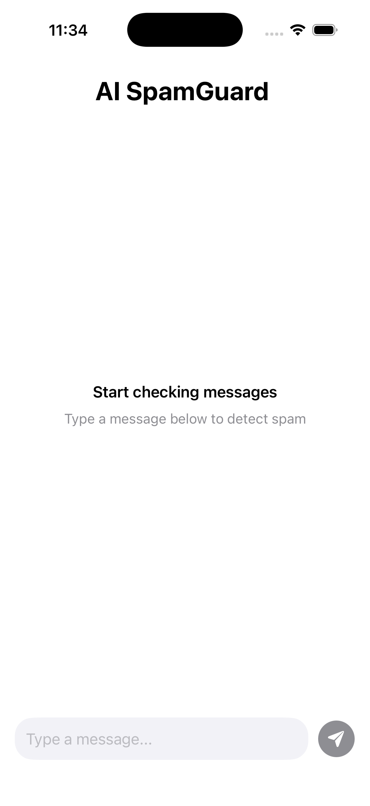
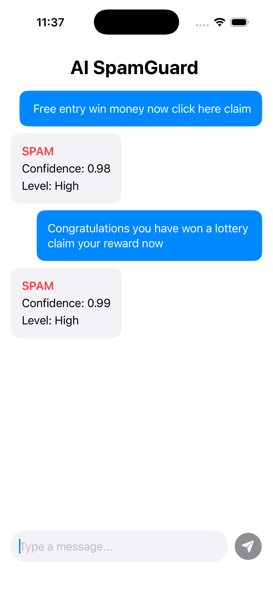
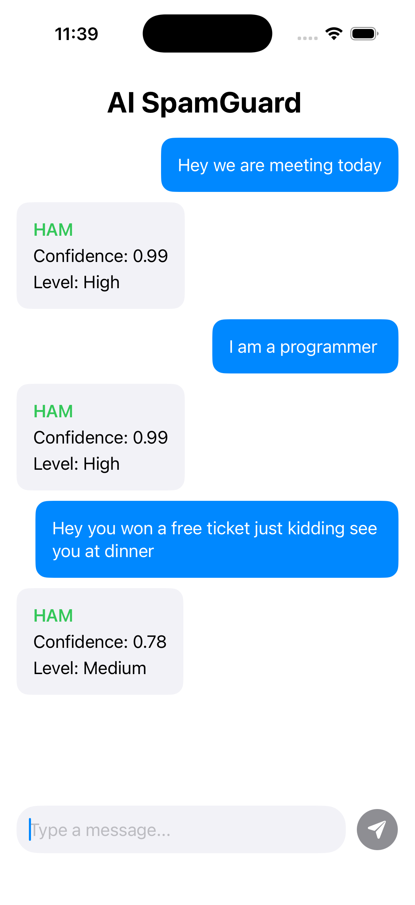

# 📱 SpamGuard AI

**End-to-End Spam Detection System (PyTorch + FastAPI + SwiftUI)**


---

## 🚀 Overview

SpamGuard AI is a full-stack machine learning application that detects spam messages in real time.
It combines:

- 🧠 **PyTorch** → Deep learning model for spam classification
- ⚡ **FastAPI** → High-performance backend API
- 📱 **SwiftUI (iOS)** → Modern mobile interface with chat-style UI

This project demonstrates how to take an ML model from **training → API → real mobile app**.

---

## ✨ Features

### 🔹 Machine Learning

- Text preprocessing (cleaning, tokenization)
- Vocabulary building & sequence encoding
- Padding for fixed-length inputs
- LSTM-based PyTorch model
- High accuracy (~97–98%)

### 🔹 Backend (FastAPI)

- REST API (`/predict`)
- JSON request/response handling
- Model + vocab loading from checkpoint
- Confidence + risk level output

### 🔹 iOS App (SwiftUI)

- Chat-style interface (like ChatGPT)
- Real-time API integration
- Typing indicator animation
- Auto-scroll to latest message
- Clean UI with spam/ham color coding

---

## 🧱 Project Structure

```
ai-spam-classifier-api/
│
├── app/                # FastAPI backend
│   └── main.py
│
├── training/           # ML pipeline (PyTorch)
│   ├── train.py
│   ├── preprocess.py
│   ├── vocab.py
│   └── dataset.py
│
├── model/              # Saved model & vocab
│   ├── model_full.pt
│   └── vocab.json
│
├── data/               # Dataset
│   └── spam.csv
│
├── ios-app/            # SwiftUI iOS app
│
└── README.md
```

---

## 📊 Model Details

- Model: **LSTM-based binary classifier**
- Input: Tokenized SMS text
- Output:
  - `prediction`: spam / ham
  - `confidence`: probability score
  - `level`: High / Medium / Low

---

## 🔌 API Usage

### Endpoint

```
POST /predict
```

### Request

```json
{
  "message": "free entry win money now"
}
```

### Response

```json
{
  "prediction": "spam",
  "confidence": 0.95,
  "level": "High"
}
```

---

## 📱 iOS App Flow

```
User Input
   ↓
Typing Indicator
   ↓
FastAPI Call
   ↓
Model Prediction
   ↓
Chat UI Response
```

---

## 🎥 Demo Video

> 📌 Add your demo video here (recommended)

```
[Paste YouTube / Loom link here]
```

---

## 📸 Screenshots

### 🏠 Home Screen

<p align="center">
  
   
    
    
</p>
---

## ⚙️ Setup Instructions

### 🔹 1. Clone repo

```bash
git clone https://github.com/your-username/ai-spam-classifier-api.git
cd ai-spam-classifier-api
```

---

### 🔹 2. Setup backend

```bash
python -m venv venv
source venv/bin/activate

pip install -r requirements.txt
```

---

### 🔹 3. Run FastAPI

```bash
uvicorn app.main:app --reload
```

Open:

```
http://127.0.0.1:8000/docs
```

---

### 🔹 4. Run iOS App

- Open `ios-app` in Xcode
- Update API URL if using real device
- Run on simulator or device

---

## 🧠 Key Learnings

- End-to-end ML system design
- Model training → deployment pipeline
- FastAPI integration with PyTorch
- SwiftUI networking & state management
- Real-world UX patterns (chat UI, typing indicator)

---

## 🚀 Future Improvements

- 🔥 Deploy API (Render / AWS)
- 🤖 Upgrade model (BERT / Transformer)
- 📊 Add analytics dashboard
- 🗂️ Chat history persistence
- 🌐 Multi-language spam detection

---

## 🙌 Author

**Akshay Kumar**

- AI Engineer (Aspiring)
- Built full-stack ML apps with PyTorch + FastAPI + iOS

---

## ⭐ If you like this project

Give it a ⭐ on GitHub and share feedback!
